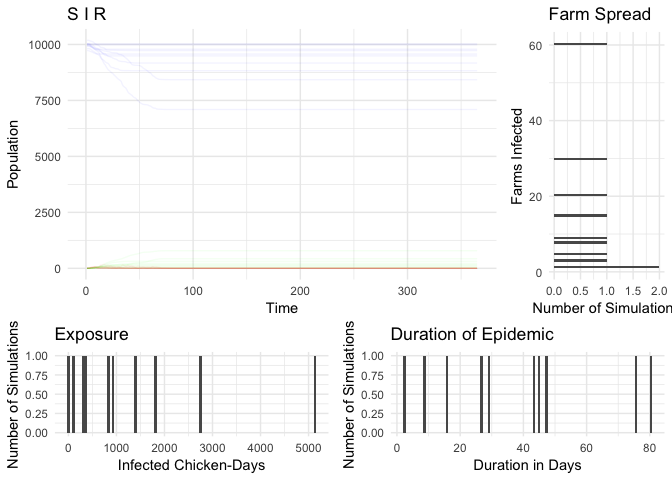
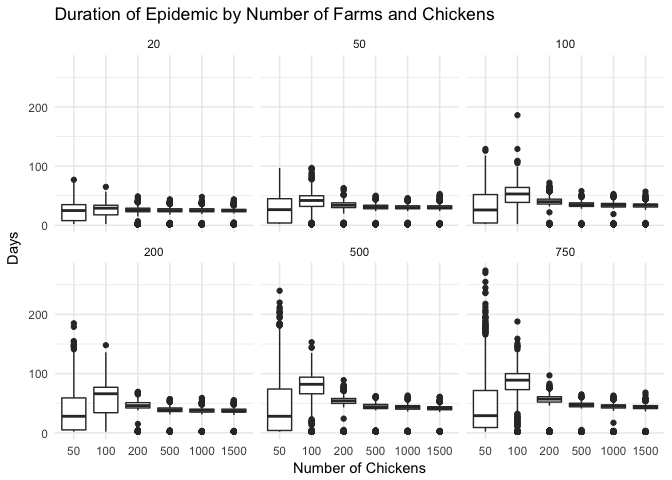
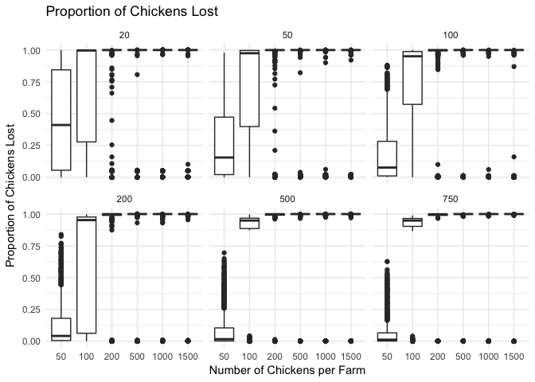
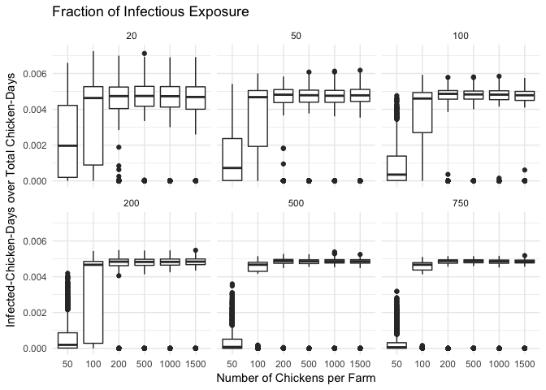
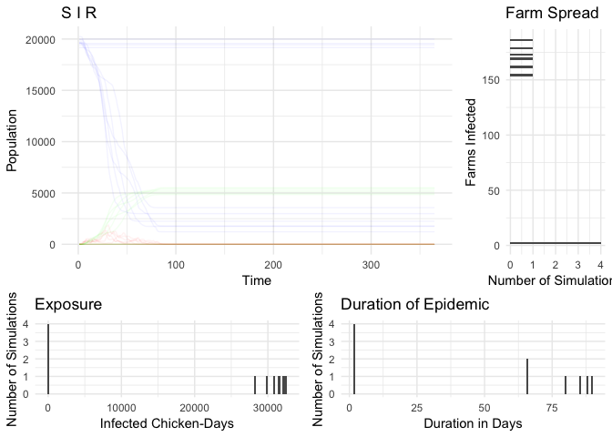
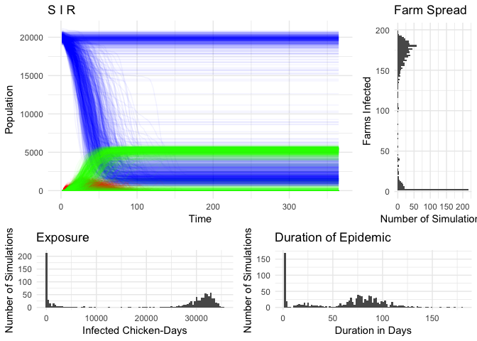
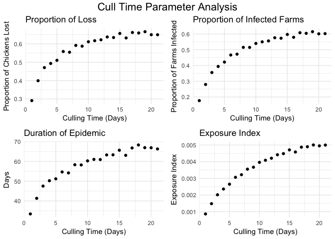

# Presentation Notes

### Basic Run

- The base scenario in this report simulates a network of 200 farms, with around 50 chickens per farm. 

- Each simulation creates a randomly generated network of farms.

- Each simulation seeds one initial infected chicken at a random farm. 

- No culling practices are implemented.

- The two GIFs below are examples of the base network scenario:

  - This graphic shows a simulation run that resulted in a long epidemic (80 days). 
  
  - Nodes represent farms, with edges illustrating connections between farms. 

  - Black nodes represent farms with a normal chicken population, while red nodes indicate farms
  with at least one infected chicken. 
  
  

  - This graphic, on the other hand, shows a short duration simulation, where a seeded infection fails to spread throughout the network. 

 

<<<<<<< HEAD
scenario         mean_prop_loss   mean_proportion_farms   mean_duration   mean_fraction_exposure
--------------  ---------------  ----------------------  --------------  -----------------------
Base Scenario         0.0757303                   0.076            37.4                0.0003736
=======
Scenario         Mean Proportion of Chickens Lost   Mean Proportion of Farms Infected   Mean Duration of Epidemic (days)   Mean Fraction of Infectious Exposure
--------------  ---------------------------------  ----------------------------------  ---------------------------------  -------------------------------------
Base Scenario                           0.0964127                             0.09982                             36.081                              0.0004667
>>>>>>> ccc16dfb7cbaaf6f88e611333adda7b1093d0e78

<!-- -->

### Scalability Across Network Size

- The following graphs show that there does not appear to be a substantial relationship between increases in the number of farms in the network and our epidemic summary statistics. 

- However, as the number of chickens increase in each farm, there are noticeable patterns of change for epidemic duration, proportion of infected farms, proportion of chickens lost across the network, and fraction of possible exposure measure. 

- Due to the scalability of this model across network size, subsequent simulations are run with a network size of 200 farms of 50 chickens. 

- The duration of the epidemic is affected by the number of chickens in each farm, but not the number of farms in the network.

<!-- -->
 
 
 
 
 

- The proportion of infected farms in a network is affected by the number of chickens in each farm, but not the number of farms in the network. 

<!-- -->
 
 
 
 
 

- The proportion of chickens lost to infection or culling in a network is affected by the number of chickens in each farm, but not the number of farms in the network. 

<!-- -->
 
 
 
 
 

- The fraction of infectious exposure is affected by the number of chickens in each farm, but not the number of farms in the network. 

<!-- -->

### Random Growth Run

- In the random growth scenario, 11% of farms grow from around 50 chickens to 500 chickens, resulting in a doubling of the total network chicken population. The location of these farms in the network is chosen at random. 

- Each simulation is seeded by choosing a random chicken to be infected. Since larger farms represent about 50% of the chicken population, there is about a 50% chance that the seeded infection will be on a larger farm.

<<<<<<< HEAD
scenario                  mean_prop_loss   mean_proportion_farms   mean_duration   mean_fraction_exposure
-----------------------  ---------------  ----------------------  --------------  -----------------------
Growth in Random Farms         0.5314347                   0.512            48.3                0.0025624
=======
Scenario                  Mean Proportion of Chickens Lost   Mean Proportion of Farms Infected   Mean Duration of Epidemic (days)   Mean Fraction of Infectious Exposure
-----------------------  ---------------------------------  ----------------------------------  ---------------------------------  -------------------------------------
Growth in Random Farms                           0.5917104                             0.57408                             62.414                              0.0028588
>>>>>>> ccc16dfb7cbaaf6f88e611333adda7b1093d0e78

<!-- -->

### Localized Growth Run No Culling

- In the localized growth scenario, 11% of farms grow from around 50 chickens to 500 chickens, resulting in a doubling of the total network chicken population. The farms chosen to grow are adjacent nodes in a network, simulating the intensification of poultry production in one geographic, closely connected area. 

- Each simulation is seeded by choosing a random chicken to be infected. Since larger farms represent about 50% of the chicken population, there is about a 50% chance that the seeded infection will be on a larger farm.

<<<<<<< HEAD
scenario                 mean_prop_loss   mean_proportion_farms   mean_duration   mean_fraction_exposure
----------------------  ---------------  ----------------------  --------------  -----------------------
Localized Farm Growth         0.5493707                   0.409            47.3                0.0026297
=======
Scenario                 Mean Proportion of Chickens Lost   Mean Proportion of Farms Infected   Mean Duration of Epidemic (days)   Mean Fraction of Infectious Exposure
----------------------  ---------------------------------  ----------------------------------  ---------------------------------  -------------------------------------
Localized Farm Growth                           0.4773329                            0.374775                             49.824                              0.0023064
>>>>>>> ccc16dfb7cbaaf6f88e611333adda7b1093d0e78

<!-- -->

<<<<<<< HEAD

### Clustered Growth Run with Culling

- Culling is implemented whenever a death is detected, representing the best case detection and reporting scenario.

- The time to culling varies from 1 to 21 days.

<!-- -->

=======
Scenario                  Mean Proportion of Chickens Lost   Mean Proportion of Farms Infected   Mean Duration of Epidemic (days)   Mean Fraction of Infectious Exposure
-----------------------  ---------------------------------  ----------------------------------  ---------------------------------  -------------------------------------
Base Scenario                                    0.0964127                            0.099820                             36.081                              0.0004667
Growth in Random Farms                           0.5917104                            0.574080                             62.414                              0.0028588
Localized Farm Growth                            0.4773329                            0.374775                             49.824                              0.0023064
>>>>>>> ccc16dfb7cbaaf6f88e611333adda7b1093d0e78
