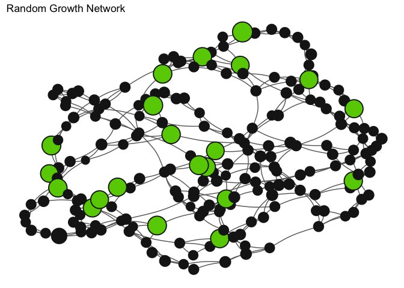
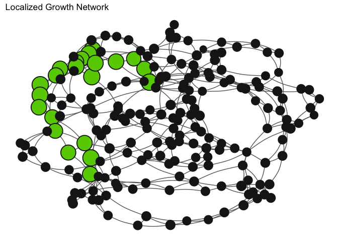

# Presentation Notes

### Basic Run

- The base scenario in this report simulates a network of 200 farms, with around 50 chickens per farm. 

- Each simulation creates a randomly generated network of farms.

- Each simulation seeds one initial infected chicken at a random farm. 

- No culling practices are implemented.

- The two GIFs below are examples of the base network scenario:

  - This graphic shows a simulation run that resulted in a long epidemic (80 days). 
  
  - Nodes represent farms, with edges illustrating connections between farms. 

  - Black nodes represent farms with a normal chicken population, while red nodes indicate farms
  with at least one infected chicken. 
  
  

  - This graphic, on the other hand, shows a short duration simulation, where a seeded infection fails to spread throughout the network. 

 

<!-- -->
 
 

Scenario                       Mean Proportion of Chickens Lost   Mean Proportion of Farms Infected   Mean Duration of Epidemic (days)   Mean Exposure Index   Proportion of Simulations that Failed to Spread
----------------------------  ---------------------------------  ----------------------------------  ---------------------------------  --------------------  ------------------------------------------------
Base Scenario                                         0.0964127                           0.0998200                           36.08100             0.0004667                                              0.28
Base Scenario - Spread Only                           0.1335270                           0.1366944                           48.55556             0.0006463                                              0.00

### Scalability Across Network Size

- The following graphs show that there does not appear to be a substantial relationship between increases in the number of farms in the network and our epidemic summary statistics. 

- However, as the number of chickens increase in each farm, there are noticeable patterns of change for epidemic duration, proportion of infected farms, proportion of chickens lost across the network, and fraction of possible exposure measure. 

- Due to the scalability of this model across network size, subsequent simulations are run with a network size of 200 farms of 50 chickens. 

- The duration of the epidemic is affected by the number of chickens in each farm, but not the number of farms in the network.

<!-- -->
 
 
 
 
 

- The proportion of infected farms in a network is affected by the number of chickens in each farm, but not the number of farms in the network. 

<!-- -->
 
 
 
 
 

- The proportion of chickens lost to infection or culling in a network is affected by the number of chickens in each farm, but not the number of farms in the network. 

<!-- -->
 
 
 
 
 

- The fraction of infectious exposure is affected by the number of chickens in each farm, but not the number of farms in the network. 

<!-- -->

### Random Growth Run

- In the random growth scenario, 11% of farms grow from around 50 chickens to 500 chickens, resulting in a doubling of the total network chicken population. The location of these farms in the network is chosen at random. 

- Each simulation is seeded by choosing a random chicken to be infected. Since larger farms represent about 50% of the chicken population, there is about a 50% chance that the seeded infection will be on a larger farm.

- The network graph below illustrates this growth scenario, with a random selection of nodes growing by a factor of 10 (indicated in green).

<!-- -->

Scenario                                Mean Proportion of Chickens Lost   Mean Proportion of Farms Infected   Mean Duration of Epidemic (days)   Mean Exposure Index   Proportion of Simulations that Failed to Spread
-------------------------------------  ---------------------------------  ----------------------------------  ---------------------------------  --------------------  ------------------------------------------------
Growth in Random Farms                                         0.5917104                           0.5740800                           62.41400             0.0028588                                             0.202
Growth in Random Farms - Spread Only                           0.7414420                           0.7181328                           77.50376             0.0035821                                             0.000
 
 

<!-- -->

### Localized Growth Run No Culling

- In the localized growth scenario, 11% of farms grow from around 50 chickens to 500 chickens, resulting in a doubling of the total network chicken population. The farms chosen to grow are adjacent nodes in a network, simulating the intensification of poultry production in one geographic, closely connected area. 

- Each simulation is seeded by choosing a random chicken to be infected. Since larger farms represent about 50% of the chicken population, there is about a 50% chance that the seeded infection will be on a larger farm.

- The network graph below illustrates this growth scenario, with a clustered selection of nodes growing by a factor of 10 (indicated in green).

<!-- -->

Scenario                                Mean Proportion of Chickens Lost   Mean Proportion of Farms Infected   Mean Duration of Epidemic (days)   Mean Exposure Index   Proportion of Simulations that Failed to Spread
-------------------------------------  ---------------------------------  ----------------------------------  ---------------------------------  --------------------  ------------------------------------------------
Base Scenario                                                  0.0964127                           0.0998200                           36.08100             0.0004667                                             0.280
Base Scenario - Spread Only                                    0.1335270                           0.1366944                           48.55556             0.0006463                                             0.000
Growth in Random Farms                                         0.5917104                           0.5740800                           62.41400             0.0028588                                             0.202
Growth in Random Farms - Spread Only                           0.7414420                           0.7181328                           77.50376             0.0035821                                             0.000
Localized Farm Growth                                          0.5127656                           0.3995100                           49.99800             0.0024792                                             0.202
Localized Farm Growth - Spread Only                            0.6424679                           0.4993734                           61.76817             0.0031063                                             0.000
 
 

<!-- -->

### Clustered Growth Run with Culling

- Culling is implemented as a two-step process:
    
    - Farms are first identified to be culled if a critical number of chickens have died in a certain time window.
    
    - Once a farm is identified, it is culled with an average speed parameterized by the *culling time* variable. When a farm is culled, all chickens (Susceptible, Infectious, and Recovered) are removed from that farm.

- The following graphs show how variation in the cull time parameter effects chicken loss, epidemic spread, duration of epidemic, and infected chicken exposure.

<!-- -->

 Culling Time (days)   Mean Proportion of Chickens Lost   Mean Proportion of Farms Infected   Mean Duration of Epidemic (days)   Mean Exposure Index
--------------------  ---------------------------------  ----------------------------------  ---------------------------------  --------------------
                   1                          0.2908635                            0.177020                             33.435             0.0008672
                   2                          0.3992773                            0.279585                             41.311             0.0014814
                   3                          0.4707156                            0.355515                             47.513             0.0020148
                   4                          0.4932861                            0.393805                             50.212             0.0023617
                   5                          0.5103106                            0.421755                             51.178             0.0026519
                   6                          0.5585069                            0.466455                             54.654             0.0030650
                   7                          0.5545843                            0.471915                             54.165             0.0032188
                   8                          0.5915634                            0.515060                             58.297             0.0035533
                   9                          0.5874925                            0.514655                             58.191             0.0036713
                  10                          0.6115625                            0.539915                             60.246             0.0039618
                  11                          0.6172856                            0.550085                             60.986             0.0040879
                  12                          0.6222489                            0.555785                             60.918             0.0042105
                  13                          0.6376711                            0.576205                             63.252             0.0044178
                  14                          0.6345393                            0.573060                             63.312             0.0044858
                  15                          0.6567254                            0.596925                             65.635             0.0047094
                  16                          0.6323005                            0.579120                             63.062             0.0045832
                  17                          0.6619602                            0.608130                             66.779             0.0048735
                  18                          0.6593961                            0.604180                             68.279             0.0048979
                  19                          0.6664469                            0.614625                             66.938             0.0050035
                  20                          0.6500229                            0.601185                             66.890             0.0049526
                  21                          0.6498694                            0.602360                             66.280             0.0049984
